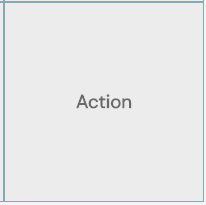
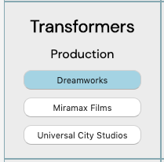

# OMDb Tic Tac Toe
https://wlaw019.github.io/OMDB-app/

* Randomly generate questions under three categories (Year, Director and Production) based on most popular 100 movies
* User can only reveal one question (Genre) at a time
* User put a "check" mark on the board if the question is answered correctly, otherwise a "X"
* Identity User Won, User Lost or No one Won and then freeze the board

## Resources Used

* OMDb API used for all the questions and answers data.  
Limitation: I can only get data one movie at a time.  No built-in filter by years or popularity as such.
http://www.omdbapi.com/

* Most popular 100 movies.         
Limitation: I had to post-process the data to fit an array format       
https://www.listchallenges.com/100-of-the-most-popular-movies-of-all-time

* Other databases explored but not used due to having the same limitation as OMDb (can only search by title)  
https://rapidapi.com/imdb/api/movie-database-imdb-alternative        
https://rapidapi.com/IVALLC/api/entertainment-data-hub


### Technology Used
* HTML
* CSS   
* Javascript
* jQuery  
* Google Fonts

### Approach Taken
Here are the steps taken for every grid on board





```html
1  <div class = "grid">
2      <h3 class = "genre"></h3>
3      <div class = "questionDiv">
4          <h4 class = "title"></h4>
5          <p class = "question"></p>
6          <div class = "ans">
7              <button class = "rightAns"></button>
8              <button class = "wrongAns"></button>
9              <button class = "wrongAns"></button>
10         </div>
11     </div>
12 </div>
```
## Functions Used to populate grid
const movie = ["The Avengers","Back to the Future","Batman",...]

const category = ["Year", "Director", "Production"]

### getData()
* This function populates line 1 to 7 based on using the movie array
* Randomly picked a movie and category then AJAX

### getDataBtn1()
* Callback function in getData()
* This function creates the 1st WrongAns button on line 8
* Randomly picked another movie but with the same category from getData() then run another AJAX

### getDataBtn2()
* Callback function in getDataBtn1
* This function creates 2nd WrongAns button on line 9
* Randomly picked another movie but with the same category from getData() then run another AJAX

### shuffleBtn()
* Callback function in getDataBtn2
* This function checks for duplicate buttons (rightAns = wrongAns, wrongAns1 = wrongAns2) and update the wrongAns with another randomly generated answer based on the ansTotal array (contains all the ans generated for the board)
* Last step is to shuffle the buttons so that the rightAns is not always the first button

*** All AJAX had to be chained to ensure the order of execution

### Limitations of the App
* My App is only as good as the API
    * No entry for the movie selected (test engineer!!!)
    * "N/A" data listed inside the API
* shuffleBtn() updates duplicate buttons but does not take care of cases like:
  * 20th Century Fox
  * 20th Century-Fox
  * twentieth Century Fox
